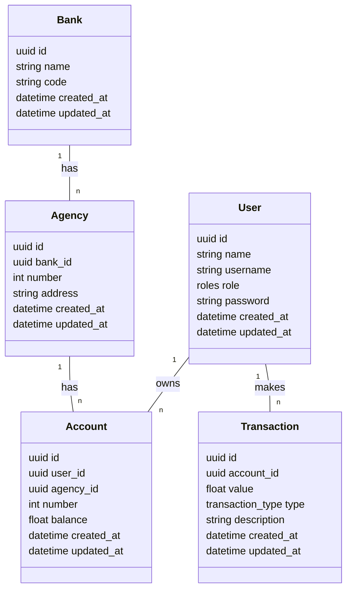

# Spring Bank

Spring Bank is a RESTful web service that provides banking services. It is built using Spring Boot, Spring Data JPA, PostgreSQL, and Docker.

## Table of Contents

- [Getting Started](#getting-started)
- [Features](#features)
- [ERD Diagram](#erd-diagram)
- [Contributing](#contributing)
- [License](#license)

## Getting Started

### Running with Docker

The easiest way to run the application is with Docker.

```bash
docker-compose up -d
```

### Running with Maven

Alternatively, you can run the application with Maven.

#### Prerequisites

- Java 22 or later (it's compatible with Java 17, but you may need to update the `sourceCompatibility` and `targetCompatibility` in the `build.gradle` file)
- Maven 3.8.1 or later

```bash
mvn spring-boot:run
```

> The application will be available at [http://localhost:8080](http://localhost:8080).

> The Adminer will be available at [http://localhost:8081](http://localhost:8081).

## Features

- Create a new account
- Get account details
- Deposit money
- Withdraw money
- Transfer money between accounts

## ERD Diagram

The following Entity-Relationship Diagram (ERD) shows the relationships between the entities in the application:



## Contributing

Contributions are welcome! Please fork the repository and submit a pull request with your changes.

## License

This project is licensed under the MIT License - see the [LICENSE](./LICENSE) file for details.
